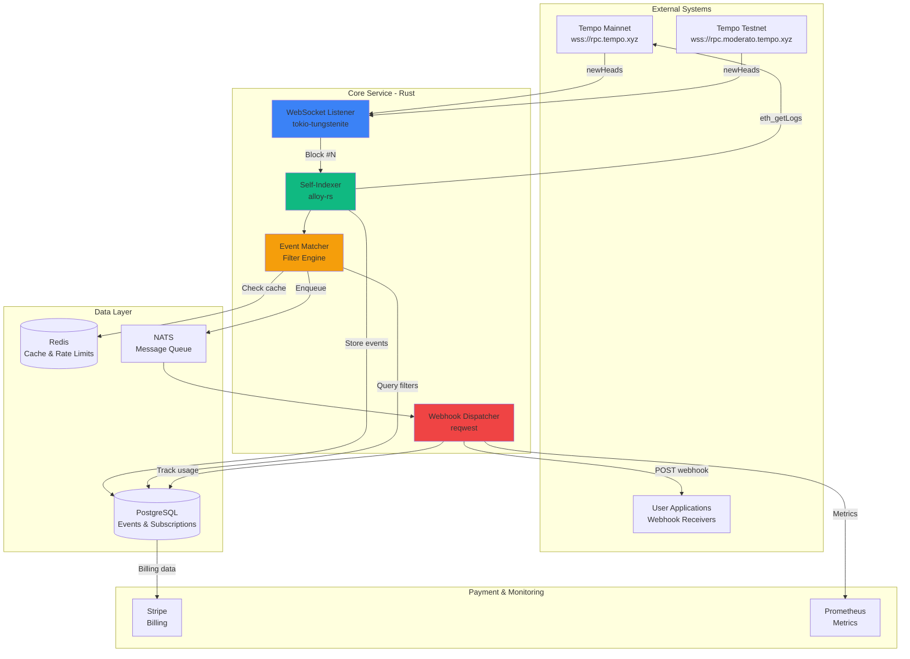
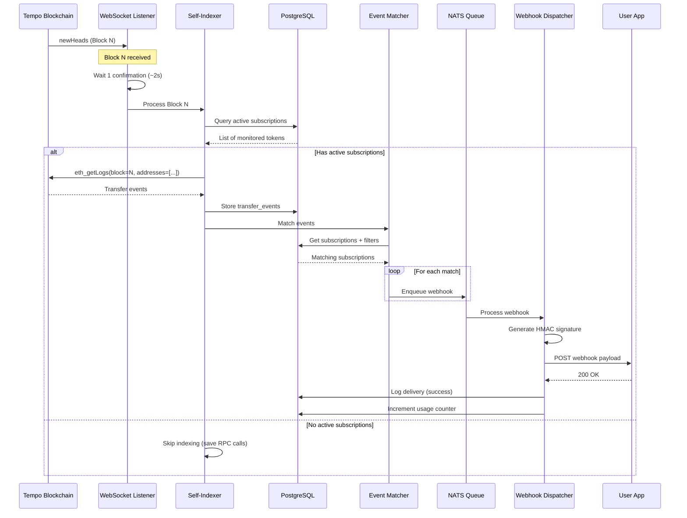
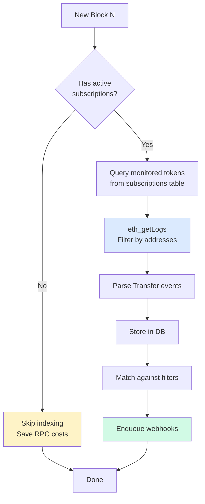
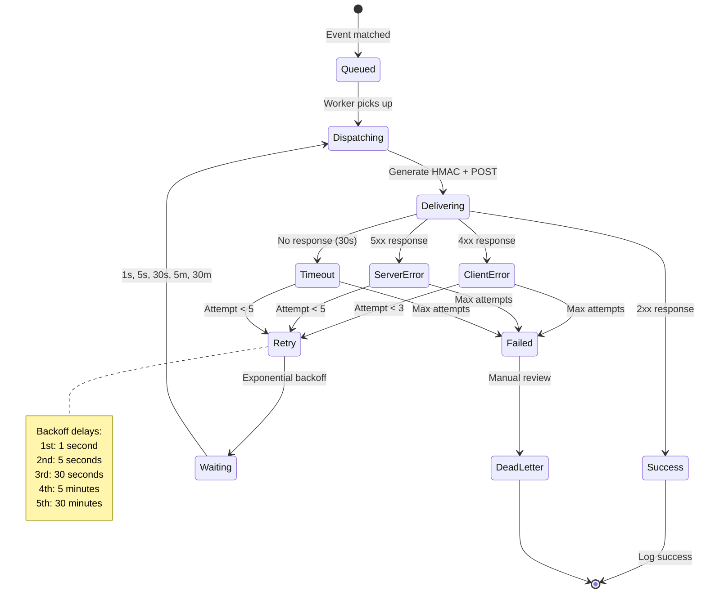
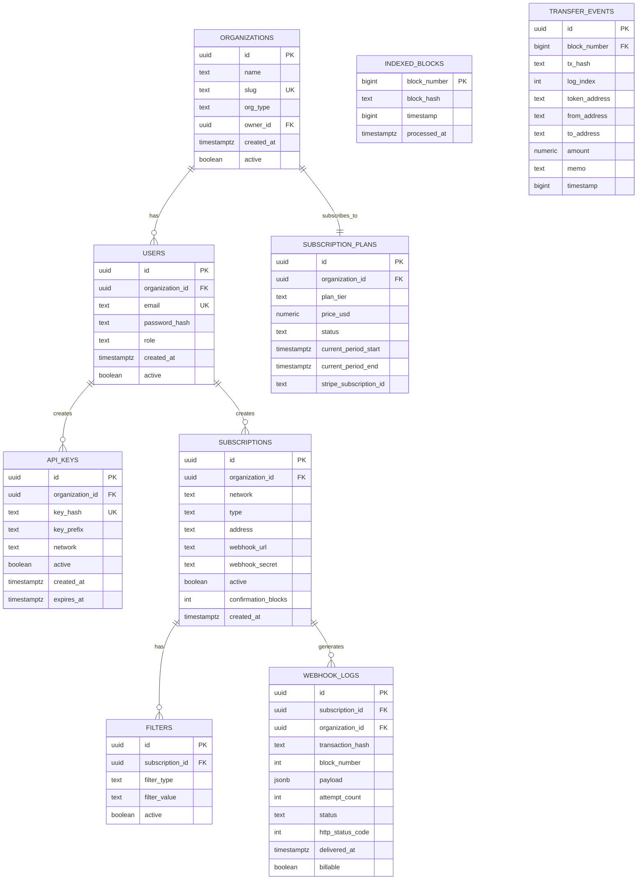

# Tempo Webhook Service - Self-Indexing Architecture

**Version 3.0 - Bootstrap Edition**  
**Zero External API Dependencies**

---

## Executive Summary

Real-time webhook notification service for Tempo blockchain with **self-indexing architecture**. Designed for payment apps, wallet providers, DeFi protocols, and enterprise users requiring instant blockchain notifications with minimal infrastructure costs.

### Key Features

- ✅ **Self-indexing with zero external API costs**
- ✅ **Direct Tempo RPC integration** (free public endpoints)
- ✅ **12 Tempo-native event types** (TIP-20, DEX, Validators)
- ✅ **Multi-organization billing** with usage-based pricing
- ✅ **Sub-second notification latency** (~500-700ms)
- ✅ **Advanced filtering** (amount, token, memo, account)
- ✅ **Battle-tested retry logic** with exponential backoff
- ✅ **Full reorg protection**
- ✅ **Bootstrap budget: $12-15/month**

### Cost Comparison

| Approach | Monthly Cost | Scalability | Bootstrap-Friendly |
|----------|-------------|-------------|-------------------|
| **IndexSupply API** | $50-200+ | Excellent | ❌ No |
| **Self-Indexing (Our Approach)** | **$12-15** | Good (1000s of users) | ✅ **Yes** |
| **Archive Node** | $100-500+ | Excellent | ❌ No |

---

## Table of Contents

1. [Architecture Overview](#architecture-overview)
2. [System Components](#system-components)
3. [Self-Indexing Strategy](#self-indexing-strategy)
4. [Database Schema](#database-schema)
5. [Event Types](#event-types)
6. [API Endpoints](#api-endpoints)
7. [Technology Stack](#technology-stack)
8. [Infrastructure Costs](#infrastructure-costs)
9. [Pricing & Business Model](#pricing--business-model)
10. [Implementation Roadmap](#implementation-roadmap)

---

## Architecture Overview

The service uses a **hybrid real-time architecture** combining WebSocket block notifications with targeted RPC queries for event data. This eliminates expensive third-party indexing APIs while maintaining sub-second webhook latency.

### High-Level Data Flow



### Core Components

1. **WebSocket Listener**: Connects to Tempo RPC endpoints for real-time block notifications
2. **Self-Indexer**: Fetches and stores only events with active subscriptions
3. **Event Matcher**: Applies user-defined filters and matches events to subscriptions
4. **Webhook Dispatcher**: Delivers webhooks with retry logic and HMAC signatures
5. **Billing Engine**: Tracks usage and manages Stripe subscriptions

### Data Flow (Step-by-Step)



---

## System Components

### 1. WebSocket Manager

**Purpose**: Real-time block notifications from Tempo blockchain

**Implementation**:
```rust
use alloy::providers::{Provider, ProviderBuilder, WsConnect};
use futures_util::StreamExt;

async fn start_block_listener() -> Result<()> {
    let ws = WsConnect::new("wss://rpc.tempo.xyz");
    let provider = ProviderBuilder::new().on_ws(ws).await?;
    
    // Subscribe to new blocks
    let sub = provider.subscribe_blocks().await?;
    let mut stream = sub.into_stream();
    
    while let Some(block) = stream.next().await {
        let block_number = block.header.number.unwrap();
        
        // Wait for 1 confirmation (Tempo: ~2 seconds)
        sleep(Duration::from_secs(2)).await;
        
        // Trigger indexing
        index_block(block_number).await?;
    }
    
    Ok(())
}
```

**Key Features**:
- Auto-reconnect on disconnect
- Multi-network support (mainnet + testnet)
- Confirmation delay (configurable per subscription)
- Reorg detection via block hash validation

---

### 2. Self-Indexer

**Purpose**: Fetch and store blockchain events efficiently

**Key Optimization**: Only index events for tokens/addresses with active subscriptions



**Implementation**:
```rust
async fn index_block(block_number: u64) -> Result<()> {
    // Get monitored tokens from active subscriptions
    let monitored_tokens = sqlx::query!(
        "SELECT DISTINCT address FROM subscriptions 
         WHERE active = true AND type IN ('TRANSFER', 'TRANSFER_WITH_MEMO')"
    )
    .fetch_all(&db)
    .await?;
    
    if monitored_tokens.is_empty() {
        // No active subscriptions = skip indexing
        return Ok(());
    }
    
    // Query logs for ONLY monitored addresses
    let filter = Filter::new()
        .from_block(block_number)
        .to_block(block_number)
        .address(monitored_tokens)
        .event_signature(TRANSFER_SIGNATURE);
    
    let logs = provider.get_logs(&filter).await?;
    
    // Parse and store
    for log in logs {
        store_transfer_event(&log).await?;
    }
    
    Ok(())
}
```

**Storage Efficiency**:
- Only stores events with active listeners
- Auto-prunes data older than 30 days
- Estimated storage: ~1.5 MB/month (negligible cost)

---

### 3. Event Matcher

**Purpose**: Match blockchain events against user subscription filters

**Supported Filters**:
- `amount_min` / `amount_max`: Filter by transfer amount
- `from_address`: Filter by sender
- `to_address`: Filter by recipient
- `memo_pattern`: Regex pattern matching for memos
- `token_address`: Specific token contracts

**Implementation**:
```rust
async fn match_events(block_number: u64) -> Result<Vec<WebhookJob>> {
    let events = sqlx::query_as!(
        TransferEvent,
        "SELECT * FROM transfer_events WHERE block_number = $1",
        block_number as i64
    )
    .fetch_all(&db)
    .await?;
    
    let mut webhooks = Vec::new();
    
    for event in events {
        // Find matching subscriptions with filters
        let matches = sqlx::query_as!(
            Subscription,
            "SELECT s.* FROM subscriptions s
             LEFT JOIN filters f ON f.subscription_id = s.id
             WHERE s.active = true
             AND s.address = $1
             AND (
                 f.id IS NULL OR
                 (f.filter_type = 'amount_min' AND $2::numeric >= f.filter_value::numeric) OR
                 (f.filter_type = 'from_address' AND $3 = f.filter_value) OR
                 (f.filter_type = 'to_address' AND $4 = f.filter_value)
             )",
            event.token_address,
            event.amount,
            event.from_address,
            event.to_address
        )
        .fetch_all(&db)
        .await?;
        
        for sub in matches {
            webhooks.push(WebhookJob {
                subscription_id: sub.id,
                event: event.clone(),
                webhook_url: sub.webhook_url,
                webhook_secret: sub.webhook_secret,
            });
        }
    }
    
    Ok(webhooks)
}
```

---

### 4. Webhook Dispatcher

**Purpose**: Reliable webhook delivery with retry logic

**Retry Strategy**:


**HMAC Signature Generation**:
```rust
use hmac::{Hmac, Mac};
use sha2::Sha256;

fn generate_signature(payload: &str, secret: &str, timestamp: i64) -> String {
    type HmacSha256 = Hmac<Sha256>;
    
    let signed_payload = format!("{}.{}", timestamp, payload);
    let mut mac = HmacSha256::new_from_slice(secret.as_bytes()).unwrap();
    mac.update(signed_payload.as_bytes());
    
    let result = mac.finalize();
    let signature = hex::encode(result.into_bytes());
    
    format!("t={},v1={}", timestamp, signature)
}
```

**Webhook Payload Example**:
```json
{
  "type": "transfer",
  "network": "mainnet",
  "blockNumber": "12345678",
  "transactionHash": "0xabc...",
  "timestamp": 1708876543,
  "from": "0x742d35Cc6634C0532925a3b844Bc9e7595f0bEb",
  "to": "0x8626f6940E2eb28930eFb4CeF49B2d1F2C9C1199",
  "token": "0x20c0000000000000000000000000000000000001",
  "amount": "1000000",
  "metadata": {
    "tokenSymbol": "AlphaUSD",
    "decimals": 6
  }
}
```

**HTTP Headers**:
```
X-Tempo-Signature: t=1708876543,v1=5257a869e7ecebeda32affa62cdca3fa51cad7e77a0e56ff536d0ce8e108d8bd
Content-Type: application/json
User-Agent: Tempo-Webhook/1.0
```

---

## Self-Indexing Strategy

### Why Self-Indexing?

**Problem with IndexSupply**:
- ❌ Expensive ($50-200+/month)
- ❌ No free tier for bootstrapping
- ❌ Adds external dependency

**Our Solution**:
- ✅ Direct RPC queries to Tempo (free)
- ✅ Only index what's needed (active subscriptions)
- ✅ Total control over data
- ✅ Bootstrap-friendly ($12-15/month total)

### Performance Characteristics

| Component | Latency | Cost |
|-----------|---------|------|
| **WebSocket notification** | ~100ms | $0 (free RPC) |
| **RPC eth_getLogs query** | ~200-300ms | $0 (free RPC) |
| **Event parsing + matching** | ~100ms | $0 |
| **Webhook dispatch** | ~100-200ms | $0 |
| **Total webhook latency** | **~500-700ms** | **$0** |

**Comparison**:
- IndexSupply latency: ~300-500ms
- Our latency: ~500-700ms
- **Difference**: +200ms (acceptable trade-off for $0 cost)**

### RPC Call Optimization

**Naive approach** (expensive):
```rust
// ❌ DON'T DO THIS
// Polls IndexSupply every second = 86,400 requests/day
loop {
    let events = indexsupply.query_latest_events().await?;
    sleep(Duration::from_secs(1)).await;
}
```

**Smart approach** (our method):
```rust
// ✅ DO THIS
// Only query when blocks arrive + only monitored addresses
while let Some(block) = ws_stream.next().await {
    let monitored = get_active_subscription_addresses().await?;
    
    if monitored.is_empty() {
        continue; // No subs = no query
    }
    
    let logs = rpc.get_logs(
        Filter::new()
            .address(monitored)  // Only specific addresses
            .from_block(block_number)
            .to_block(block_number)
    ).await?;
}
```

**Cost savings**:
- Tempo block time: 2 seconds
- Blocks per day: 43,200
- RPC calls per day: **~43,200** (vs 86,400 with polling)
- With 3-block confirmation: **~14,400 calls/day**
- **With selective indexing**: Only when subscriptions exist

### Storage Optimization

**Auto-pruning**:
```sql
-- Daily cron job
DELETE FROM transfer_events 
WHERE timestamp < EXTRACT(EPOCH FROM NOW() - INTERVAL '30 days');

DELETE FROM indexed_blocks 
WHERE block_number < (
    SELECT MAX(block_number) - 864000 FROM indexed_blocks
);  -- Keep last ~20 days (864000 blocks at 2s)
```

**Storage estimates**:
- 100 events/day × 30 days = 3,000 events
- ~500 bytes per event = 1.5 MB
- PostgreSQL free tier: 100 MB+ ✅

---

## Database Schema

### Core Tables



### SQL Schema

```sql
-- Organizations
CREATE TABLE organizations (
    id UUID PRIMARY KEY DEFAULT gen_random_uuid(),
    name TEXT NOT NULL,
    slug TEXT UNIQUE NOT NULL,
    org_type TEXT CHECK(org_type IN ('individual', 'team', 'enterprise')),
    owner_id UUID NOT NULL,
    created_at TIMESTAMPTZ DEFAULT NOW(),
    active BOOLEAN DEFAULT true
);

-- Users
CREATE TABLE users (
    id UUID PRIMARY KEY DEFAULT gen_random_uuid(),
    organization_id UUID NOT NULL REFERENCES organizations(id),
    email TEXT UNIQUE NOT NULL,
    password_hash TEXT NOT NULL,
    full_name TEXT,
    role TEXT CHECK(role IN ('owner', 'admin', 'developer', 'viewer')),
    created_at TIMESTAMPTZ DEFAULT NOW(),
    active BOOLEAN DEFAULT true
);

-- Subscription Plans
CREATE TABLE subscription_plans (
    id UUID PRIMARY KEY DEFAULT gen_random_uuid(),
    organization_id UUID NOT NULL REFERENCES organizations(id) UNIQUE,
    plan_tier TEXT CHECK(plan_tier IN ('free', 'starter', 'pro', 'enterprise')),
    billing_cycle TEXT CHECK(billing_cycle IN ('monthly', 'yearly')),
    price_usd NUMERIC(10, 2),
    status TEXT CHECK(status IN ('active', 'cancelled', 'past_due', 'trialing')),
    current_period_start TIMESTAMPTZ,
    current_period_end TIMESTAMPTZ,
    stripe_subscription_id TEXT UNIQUE,
    created_at TIMESTAMPTZ DEFAULT NOW()
);

-- API Keys
CREATE TABLE api_keys (
    id UUID PRIMARY KEY DEFAULT gen_random_uuid(),
    organization_id UUID NOT NULL REFERENCES organizations(id),
    user_id UUID NOT NULL REFERENCES users(id),
    key_hash TEXT UNIQUE NOT NULL,
    key_prefix TEXT NOT NULL, -- e.g., "tempo_live_abc123..."
    name TEXT,
    network TEXT CHECK(network IN ('mainnet', 'testnet', 'both')),
    active BOOLEAN DEFAULT true,
    created_at TIMESTAMPTZ DEFAULT NOW(),
    expires_at TIMESTAMPTZ,
    last_used TIMESTAMPTZ,
    request_count BIGINT DEFAULT 0
);

CREATE INDEX idx_api_keys_hash ON api_keys(key_hash) WHERE active = true;

-- Subscriptions
CREATE TABLE subscriptions (
    id UUID PRIMARY KEY DEFAULT gen_random_uuid(),
    organization_id UUID NOT NULL REFERENCES organizations(id),
    user_id UUID NOT NULL REFERENCES users(id),
    network TEXT NOT NULL CHECK(network IN ('mainnet', 'testnet')),
    type TEXT NOT NULL, -- TRANSFER, TRANSFER_WITH_MEMO, SWAP, etc.
    address TEXT NOT NULL, -- Token or contract address to monitor
    webhook_url TEXT NOT NULL,
    webhook_secret TEXT NOT NULL,
    active BOOLEAN DEFAULT true,
    confirmation_blocks INT DEFAULT 1,
    created_at TIMESTAMPTZ DEFAULT NOW(),
    updated_at TIMESTAMPTZ DEFAULT NOW()
);

CREATE INDEX idx_subscriptions_address ON subscriptions(address, active) WHERE active = true;
CREATE INDEX idx_subscriptions_org ON subscriptions(organization_id, active);

-- Filters
CREATE TABLE filters (
    id UUID PRIMARY KEY DEFAULT gen_random_uuid(),
    subscription_id UUID NOT NULL REFERENCES subscriptions(id) ON DELETE CASCADE,
    filter_type TEXT NOT NULL CHECK(filter_type IN (
        'amount_min', 'amount_max', 'token_address', 
        'memo_pattern', 'from_address', 'to_address'
    )),
    filter_value TEXT NOT NULL,
    active BOOLEAN DEFAULT true
);

CREATE INDEX idx_filters_subscription ON filters(subscription_id);

-- Indexed Blocks (for reorg detection)
CREATE TABLE indexed_blocks (
    block_number BIGINT PRIMARY KEY,
    block_hash TEXT NOT NULL,
    timestamp BIGINT NOT NULL,
    processed_at TIMESTAMPTZ DEFAULT NOW()
);

CREATE INDEX idx_indexed_blocks_timestamp ON indexed_blocks(timestamp DESC);

-- Transfer Events (lightweight storage)
CREATE TABLE transfer_events (
    id UUID PRIMARY KEY DEFAULT gen_random_uuid(),
    block_number BIGINT NOT NULL,
    tx_hash TEXT NOT NULL,
    log_index INT NOT NULL,
    token_address TEXT NOT NULL,
    from_address TEXT NOT NULL,
    to_address TEXT NOT NULL,
    amount NUMERIC NOT NULL,
    memo TEXT, -- NULL if not TransferWithMemo
    timestamp BIGINT NOT NULL,
    UNIQUE(tx_hash, log_index)
);

-- Optimized indexes for common queries
CREATE INDEX idx_transfers_token ON transfer_events(token_address, block_number DESC);
CREATE INDEX idx_transfers_from ON transfer_events(from_address, block_number DESC);
CREATE INDEX idx_transfers_to ON transfer_events(to_address, block_number DESC);
CREATE INDEX idx_transfers_block ON transfer_events(block_number DESC);

-- Webhook Logs (for billing and debugging)
CREATE TABLE webhook_logs (
    id UUID PRIMARY KEY DEFAULT gen_random_uuid(),
    subscription_id UUID NOT NULL REFERENCES subscriptions(id),
    organization_id UUID NOT NULL REFERENCES organizations(id),
    transaction_hash TEXT NOT NULL,
    block_number INT NOT NULL,
    payload JSONB NOT NULL,
    attempt_count INT DEFAULT 1,
    status TEXT CHECK(status IN ('pending', 'delivered', 'failed', 'retrying')),
    http_status_code INT,
    error_message TEXT,
    first_attempt TIMESTAMPTZ DEFAULT NOW(),
    last_attempt TIMESTAMPTZ,
    delivered_at TIMESTAMPTZ,
    latency_ms BIGINT,
    billable BOOLEAN DEFAULT true
);

CREATE INDEX idx_webhook_logs_sub ON webhook_logs(subscription_id, first_attempt DESC);
CREATE INDEX idx_webhook_logs_org ON webhook_logs(organization_id, first_attempt DESC);
CREATE INDEX idx_webhook_logs_status ON webhook_logs(status) WHERE status IN ('pending', 'retrying');

-- Usage Records (for billing)
CREATE TABLE usage_records (
    id UUID PRIMARY KEY DEFAULT gen_random_uuid(),
    organization_id UUID NOT NULL REFERENCES organizations(id),
    usage_date DATE NOT NULL,
    api_requests INT DEFAULT 0,
    webhook_deliveries INT DEFAULT 0,
    active_subscriptions INT DEFAULT 0,
    estimated_cost NUMERIC(10, 2),
    recorded_at TIMESTAMPTZ DEFAULT NOW(),
    UNIQUE(organization_id, usage_date)
);

CREATE INDEX idx_usage_org_date ON usage_records(organization_id, usage_date DESC);
```

---

## Event Types

### 1. TIP-20 Token Events

#### TRANSFER / TRANSFER_WITH_MEMO
```json
{
  "type": "transfer",
  "network": "mainnet",
  "blockNumber": "12345678",
  "transactionHash": "0xabc...",
  "timestamp": 1708876543,
  "from": "0x742d35Cc6634C0532925a3b844Bc9e7595f0bEb",
  "to": "0x8626f6940E2eb28930eFb4CeF49B2d1F2C9C1199",
  "token": "0x20c0000000000000000000000000000000000001",
  "amount": "1000000",
  "memo": "Invoice #12345",
  "metadata": {
    "tokenSymbol": "AlphaUSD",
    "tokenName": "AlphaUSD",
    "decimals": 6,
    "currency": "USD"
  }
}
```

#### MINT / BURN
```json
{
  "type": "mint",
  "network": "mainnet",
  "token": "0x20c0000000000000000000000000000000000001",
  "to": "0x8626f6940E2eb28930eFb4CeF49B2d1F2C9C1199",
  "amount": "5000000",
  "transactionHash": "0xdef...",
  "blockNumber": "12345679"
}
```

### 2. DEX Events

#### SWAP (Derived from paired transfers)
```json
{
  "type": "swap",
  "trader": "0x8626f6940E2eb28930eFb4CeF49B2d1F2C9C1199",
  "tokenIn": "0x20c0000000000000000000000000000000000001",
  "tokenOut": "0x20c0000000000000000000000000000000000002",
  "amountIn": "1000000",
  "amountOut": "998000",
  "transactionHash": "0xghi...",
  "blockNumber": "12345680",
  "metadata": {
    "tokenInSymbol": "AlphaUSD",
    "tokenOutSymbol": "BetaUSD",
    "effectivePrice": "0.998"
  }
}
```

### 3. Validator Events

#### VALIDATOR_STATUS_CHANGED
```json
{
  "type": "validator_status_changed",
  "validator": "0x8626f6940E2eb28930eFb4CeF49B2d1F2C9C1199",
  "active": false,
  "transactionHash": "0xjkl...",
  "blockNumber": "12345681"
}
```

---

## API Endpoints

### Authentication

All API requests require an API key in the header:
```
X-API-Key: tempo_live_xxxxxxxxxxxxx
```

### 1. Create Subscription

**Request**:
```http
POST /api/v1/subscriptions
Content-Type: application/json
X-API-Key: tempo_live_xxxxx

{
  "type": "TRANSFER",
  "network": "mainnet",
  "address": "0x20c0000000000000000000000000000000000001",
  "webhook_url": "https://api.myapp.com/webhooks/transfers",
  "webhook_secret": "whsec_xxxxx",
  "filters": [
    {
      "type": "amount_min",
      "value": "1000000"
    }
  ],
  "confirmation_blocks": 1
}
```

**Response**:
```json
{
  "id": "sub_abc123",
  "type": "TRANSFER",
  "network": "mainnet",
  "address": "0x20c0000000000000000000000000000000000001",
  "webhook_url": "https://api.myapp.com/webhooks/transfers",
  "active": true,
  "confirmation_blocks": 1,
  "created_at": "2026-02-12T10:30:00Z",
  "filters": [
    {
      "id": "flt_xyz789",
      "type": "amount_min",
      "value": "1000000",
      "active": true
    }
  ]
}
```

### 2. List Subscriptions

**Request**:
```http
GET /api/v1/subscriptions?limit=50&offset=0
X-API-Key: tempo_live_xxxxx
```

**Response**:
```json
{
  "subscriptions": [
    {
      "id": "sub_abc123",
      "type": "TRANSFER",
      "network": "mainnet",
      "address": "0x20c0000000000000000000000000000000000001",
      "active": true,
      "created_at": "2026-02-12T10:30:00Z"
    }
  ],
  "total": 23,
  "has_more": false
}
```

### 3. Get Webhook Logs

**Request**:
```http
GET /api/v1/webhooks/logs?subscription_id=sub_abc123&limit=100
X-API-Key: tempo_live_xxxxx
```

**Response**:
```json
{
  "logs": [
    {
      "id": "log_def456",
      "subscription_id": "sub_abc123",
      "transaction_hash": "0xabc...",
      "block_number": 12345678,
      "status": "delivered",
      "http_status_code": 200,
      "attempt_count": 1,
      "latency_ms": 145,
      "delivered_at": "2026-02-12T10:31:00Z"
    }
  ],
  "total": 1243,
  "has_more": true
}
```

### 4. Get Usage Stats

**Request**:
```http
GET /api/v1/usage?start_date=2026-02-01&end_date=2026-02-28
X-API-Key: tempo_live_xxxxx
```

**Response**:
```json
{
  "period": {
    "start": "2026-02-01",
    "end": "2026-02-28"
  },
  "usage": {
    "webhook_deliveries": 45203,
    "api_requests": 12456,
    "active_subscriptions": 23
  },
  "quota": {
    "webhook_deliveries": 100000,
    "overage": 0,
    "overage_cost": 0.00
  },
  "plan": "pro"
}
```

---

## Technology Stack

### Backend

| Component | Technology | Reason |
|-----------|-----------|--------|
| **Language** | Rust | Low memory footprint, high performance, perfect for bootstrapping |
| **Web Framework** | Axum | Async, lightweight, great ecosystem |
| **Database** | PostgreSQL 16 | Native partitioning, excellent indexing |
| **Cache** | Redis 7 | Rate limiting, session management |
| **Queue** | NATS | Lightweight, Rust-friendly message queue |
| **Blockchain** | Alloy-rs | Modern Ethereum library for Rust |

### Key Rust Libraries

```toml
[dependencies]
# Blockchain
alloy = { version = "0.1", features = ["providers", "rpc-types", "transports"] }

# Web server
axum = "0.7"
tower = "0.4"
tower-http = "0.5"

# Async runtime
tokio = { version = "1", features = ["full"] }
futures = "0.3"

# Database
sqlx = { version = "0.7", features = ["postgres", "runtime-tokio", "uuid", "chrono"] }

# Redis
redis = { version = "0.25", features = ["tokio-comp", "connection-manager"] }

# Message queue
async-nats = "0.33"

# HTTP client (for webhooks)
reqwest = { version = "0.12", features = ["json"] }

# Serialization
serde = { version = "1.0", features = ["derive"] }
serde_json = "1.0"

# Crypto (for HMAC signatures)
hmac = "0.12"
sha2 = "0.10"
hex = "0.4"

# Error handling
anyhow = "1.0"
thiserror = "1.0"

# Retry logic
backoff = "0.4"

# Logging & metrics
tracing = "0.1"
tracing-subscriber = "0.3"
prometheus = "0.13"

# Utilities
uuid = { version = "1.0", features = ["v4", "serde"] }
chrono = { version = "0.4", features = ["serde"] }
```

---

## Infrastructure Costs

### Bootstrap Budget Breakdown

| Service | Provider | Spec | Monthly Cost |
|---------|----------|------|--------------|
| **PostgreSQL** | Render.com | 2GB RAM, 20GB storage | $7 |
| **Redis** | Upstash | 100MB, 10k commands/day | $0 (free tier) |
| **Rust App Hosting** | Fly.io | 256MB RAM | $5 |
| **Tempo RPC** | Tempo Network | WebSocket + HTTP | $0 (free public) |
| **Domain** | Cloudflare | .com | $1/mo |
| **TOTAL** | | | **$13/month** |

### Why This Works

**Rust's Memory Efficiency**:
- Small binary size (~10-20MB)
- Low memory footprint (~50-100MB RAM)
- Perfect for cheap hosting tiers

**Selective Indexing**:
- Only stores events with active subscriptions
- Auto-prunes old data (30 days)
- Minimal database growth

**Free Tier Optimization**:
- Redis free tier: 100MB (plenty for rate limiting)
- Tempo RPC: Free public endpoints
- No external API costs

### Scaling Path

| Phase | Users | Infrastructure Cost | Revenue | Margin |
|-------|-------|---------------------|---------|--------|
| **Month 1-3: MVP** | 10-50 | $13/mo | $0-500 | -$13 to +$487 |
| **Month 4-6: Growth** | 50-200 | $20-30/mo | $1,500-3,000 | +$1,470 to +$2,980 |
| **Month 7+: Scale** | 200-1000 | $50-100/mo | $5,000-20,000 | +$4,900 to +$19,950 |
| **Month 12+: Profitable** | 1000+ | $200-300/mo | $20,000-50,000 | +$19,700 to +$49,800 |

**Scaling triggers**:
- 100+ active orgs → Upgrade to $20/mo PostgreSQL
- 500+ active orgs → Add read replica ($15/mo)
- 1000+ active orgs → Consider dedicated infrastructure

---

## Pricing & Business Model

### Subscription Tiers

| Feature | Free | Starter | Pro | Enterprise |
|---------|------|---------|-----|------------|
| **Price** | $0/mo | $29/mo | $99/mo | Custom |
| **API Requests/min** | 10 | 100 | 1,000 | Custom |
| **Subscriptions** | 10 | 100 | 1,000 | Unlimited |
| **Webhooks/month** | 1,000 | 10,000 | 100,000 | Custom |
| **Networks** | Testnet only | Both | Both | Both |
| **Overage** | None | $0.01/1k | $0.005/1k | Custom |
| **Max Overage** | N/A | 5,000 | 50,000 | Unlimited |
| **Support** | Community | Email | Priority | Dedicated |
| **Advanced Filters** | ❌ | ❌ | ✅ | ✅ |
| **SLA** | ❌ | ❌ | ❌ | 99.9% |

### Revenue Model

**Monthly Recurring Revenue (MRR)**:
- Free tier: Freemium onboarding
- Starter ($29): Small apps, hobby projects
- Pro ($99): Production apps, growing businesses
- Enterprise (Custom): Large organizations

**Example Revenue Projection**:

| Month | Free Users | Starter | Pro | Enterprise | MRR |
|-------|-----------|---------|-----|------------|-----|
| Month 3 | 50 | 5 | 0 | 0 | $145 |
| Month 6 | 100 | 20 | 5 | 0 | $1,075 |
| Month 12 | 200 | 50 | 20 | 2 | $4,930 |
| Month 24 | 500 | 100 | 50 | 10 | $21,850 |

---

## Implementation Roadmap

### Phase 1: Core Infrastructure (Weeks 1-2)

**Goals**: Set up foundational systems

**Tasks**:
- [ ] Initialize Rust project with Axum
- [ ] Set up PostgreSQL schema with migrations (sqlx)
- [ ] Implement Redis connection pool
- [ ] Create basic auth middleware (API key validation)
- [ ] Set up NATS message queue
- [ ] Configure logging with tracing

**Deliverables**:
- Working Rust server
- Database with all tables
- Health check endpoint

---

### Phase 2: WebSocket & Indexing (Weeks 3-4)

**Goals**: Real-time block processing with self-indexing

**Tasks**:
- [ ] Implement WebSocket connection to Tempo RPC
- [ ] Create block listener with auto-reconnect
- [ ] Build self-indexer for Transfer events
- [ ] Implement selective indexing (only active subscriptions)
- [ ] Add reorg detection
- [ ] Create event parser for Transfer/TransferWithMemo

**Deliverables**:
- Real-time block indexing
- Transfer events stored in DB
- Reorg protection working

---

### Phase 3: Subscriptions & Matching (Weeks 5-6)

**Goals**: User subscriptions with filtering

**Tasks**:
- [ ] Implement subscription CRUD endpoints
- [ ] Build event matching engine
- [ ] Add filter support (amount, address, memo)
- [ ] Create subscription validation
- [ ] Implement organization/user management
- [ ] Add API key generation

**Deliverables**:
- Full subscription API
- Event filtering working
- Multi-organization support

---

### Phase 4: Webhook Delivery (Weeks 7-8)

**Goals**: Reliable webhook delivery

**Tasks**:
- [ ] Implement webhook dispatcher
- [ ] Add HMAC signature generation
- [ ] Build retry logic with exponential backoff
- [ ] Create dead letter queue for failures
- [ ] Add webhook logs to TimescaleDB
- [ ] Implement rate limiting per organization

**Deliverables**:
- Working webhook delivery
- Retry logic functional
- Delivery logs accessible via API

---

### Phase 5: Billing & Dashboard (Weeks 9-10)

**Goals**: Stripe integration and usage tracking

**Tasks**:
- [ ] Integrate Stripe for subscriptions
- [ ] Implement usage tracking (webhooks, API calls)
- [ ] Create billing aggregation jobs
- [ ] Add quota enforcement
- [ ] Build admin dashboard (React/Next.js)
- [ ] Create user documentation

**Deliverables**:
- Stripe billing live
- Usage-based pricing working
- Basic dashboard for users

---

### Phase 6: Testing & Launch (Weeks 11-12)

**Goals**: Production-ready service

**Tasks**:
- [ ] Write integration tests
- [ ] Load testing (simulate 1000+ webhooks/sec)
- [ ] Security audit (auth, HMAC, SQL injection)
- [ ] Set up monitoring (Prometheus + Grafana)
- [ ] Deploy to production (Fly.io)
- [ ] Launch marketing site

**Deliverables**:
- Production deployment
- Monitoring dashboards
- Public documentation
- Beta users onboarded

---

## Next Steps

### Immediate Actions

1. **Set up development environment**:
   ```bash
   cargo new tempo-webhooks
   cd tempo-webhooks
   
   # Add dependencies
   cargo add axum tokio sqlx redis async-nats alloy
   cargo add serde serde_json tracing
   ```

2. **Create PostgreSQL database**:
   - Sign up for Render.com ($7/mo)
   - Run migration scripts
   - Test connection from local Rust app

3. **Implement WebSocket listener** (MVP):
   ```rust
   // Start with simple block listener
   // Print block numbers to console
   // Verify connection stability
   ```

4. **Build first subscription**:
   - Hardcode a test subscription
   - Index Transfer events for one token
   - Verify events are stored

### Success Metrics

**Week 2**:
- ✅ WebSocket receiving blocks
- ✅ Database storing events
- ✅ Basic API responding

**Week 4**:
- ✅ First webhook delivered
- ✅ Event filtering working
- ✅ Retry logic functional

**Week 8**:
- ✅ 5+ beta users
- ✅ 100+ webhooks delivered
- ✅ Zero downtime

**Week 12**:
- ✅ Public launch
- ✅ 50+ users
- ✅ First paying customer

---

## Appendix

### Webhook Signature Verification (Client-Side)

**Node.js Example**:
```javascript
const crypto = require('crypto');

function verifyWebhook(payload, signature, secret) {
  const [timestampPart, hashPart] = signature.split(',');
  const timestamp = timestampPart.split('=')[1];
  const hash = hashPart.split('=')[1];
  
  // Prevent replay attacks (5 minute window)
  if (Date.now() / 1000 - timestamp > 300) {
    return false;
  }
  
  const signedPayload = `${timestamp}.${JSON.stringify(payload)}`;
  const expectedHash = crypto
    .createHmac('sha256', secret)
    .update(signedPayload)
    .digest('hex');
  
  return crypto.timingSafeEqual(
    Buffer.from(hash),
    Buffer.from(expectedHash)
  );
}

// Express.js middleware
app.post('/webhooks/tempo', (req, res) => {
  const signature = req.headers['x-tempo-signature'];
  const secret = process.env.WEBHOOK_SECRET;
  
  if (!verifyWebhook(req.body, signature, secret)) {
    return res.status(401).send('Invalid signature');
  }
  
  // Process webhook
  console.log('Transfer received:', req.body);
  res.status(200).send('OK');
});
```

### Useful Commands

**Database Migrations**:
```bash
# Create migration
sqlx migrate add create_subscriptions

# Run migrations
sqlx migrate run

# Revert last migration
sqlx migrate revert
```

**Testing**:
```bash
# Run tests
cargo test

# Run with logs
RUST_LOG=debug cargo test

# Run specific test
cargo test test_webhook_delivery
```

**Deployment**:
```bash
# Build for production
cargo build --release

# Deploy to Fly.io
fly deploy

# View logs
fly logs

# SSH into instance
fly ssh console
```

---

**Last Updated**: February 12, 2026  
**Version**: 3.0 (Self-Indexing Edition)  
**License**: MIT